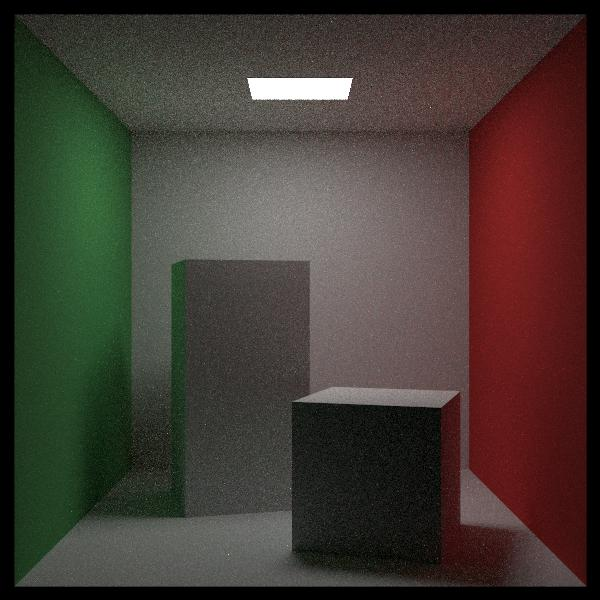

# Reading && Implementation
reference: [Ray Tracing in One Weekend — The Book Series](https://raytracing.github.io/)
# raytracing
## 00 camera and multithreading

## 01 background

## 02 sphere and hittable object

## 03 antialiasing

## 04 simple diffuse material

## 05 gamma correction

## 06 diffuse material lambertian

## 07 metal material

## 08 recursive to iterative

## 09 fuzzy reflection

## 10 dielectrics snell law

## 11 dielectrics total internal reflection

## 12 dielectrics schlick approximation

## 13 dielectrics hollow glass

## 14 defocus blur

## 15 final scene 0

## 16 motion blur

## 17 bvh

## 18 texture

## 19 texture shpere space coordinate

## 20 texture sphere texture coordinate

## 21 texture sphere image texture

## 22 perlin noise

## 23 perlin noise smoothing

## 24 perlin noise hermitian smoothing

## 25 perlin noise frequency

## 26 perlin noise random vector

## 27 perlin noise turbulence

## 28 perlin noise phase

## 29 quad

## 30 lights

## 31 instance

## 32 volumes

## 33 final scene 1

## 34 samplling stratification

## 35 perfect match sampling lambertian material

## 36 WRONG uniform sampling lambertian material

## 37 CORRECT uniform sampling lambertian material

## 38 hemispherical uniform diffuse material uniform sampling aka perfect match sampling

## 39 hemispherical uniform diffuse material consine sampling

## 40 inversion method consine sampling lambertian material

## 41 uniform sphere sampling isotropic material

## 42 only sampling lights directly

## 43 unidirectional light

## 44 pdf class

## 45 sampling directions towards a hittable aka only sampling lights directly

## 46 mixture pdf

## 47 clean up pdf management

## 48 sampling a sphere object

## 49 sampling hittable list and make sphere as light source

## 50 triangle

## 51 triangle mesh

## 52 fragment shader

